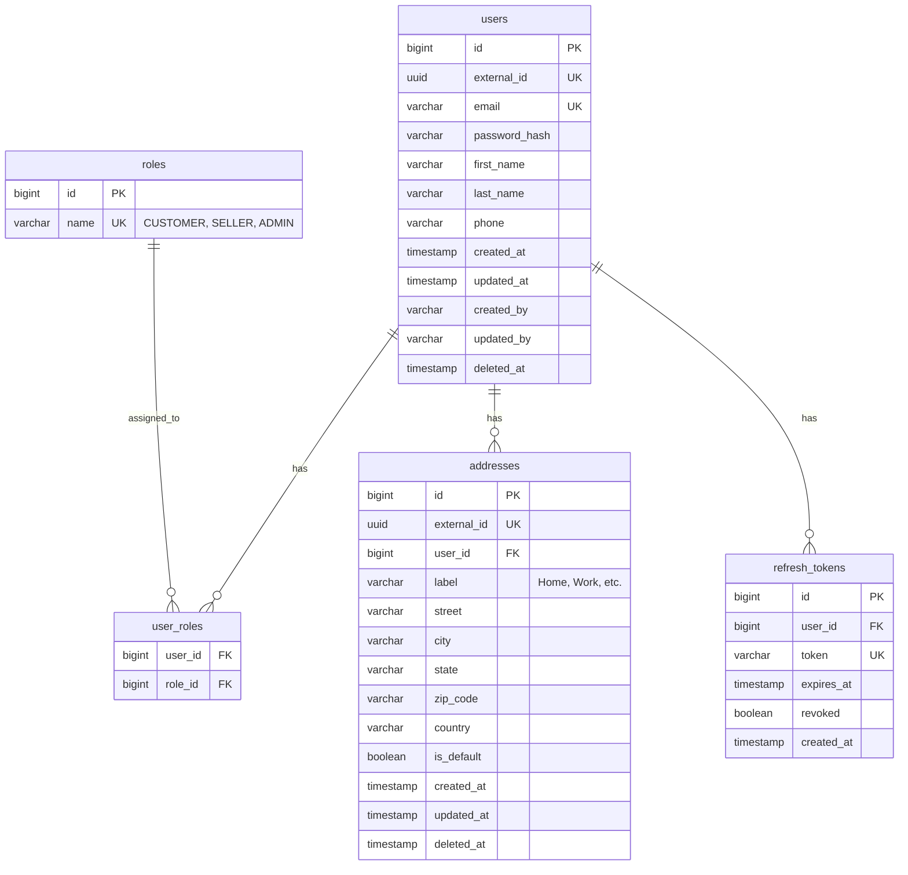
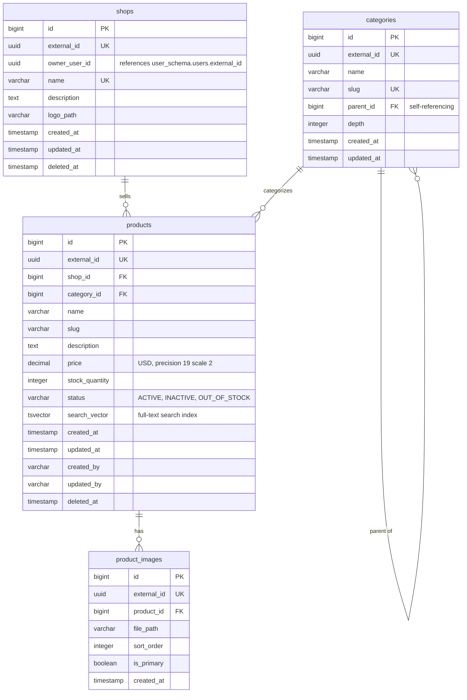
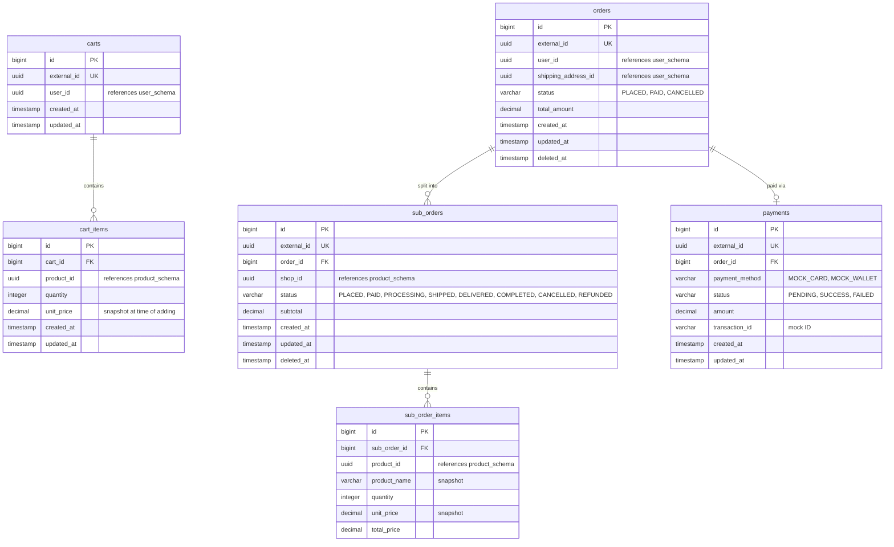
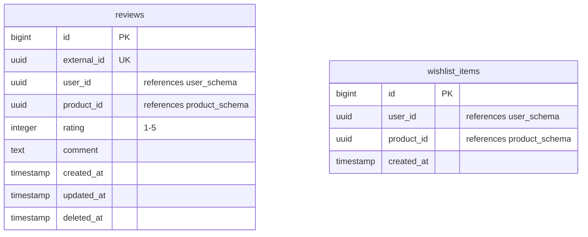

# Architecture — Database & Entity Design

---

## 5. Entity Design

### 5.1 Base Entity

All entities extend a common `BaseEntity`:

```java
@MappedSuperclass
@EntityListeners(AuditingEntityListener.class)
@Getter @Setter
public abstract class BaseEntity {

    @Id
    @GeneratedValue(strategy = GenerationType.IDENTITY)
    private Long id;

    @Column(nullable = false, unique = true, updatable = false)
    private UUID externalId = UUID.randomUUID();

    @CreatedDate
    @Column(nullable = false, updatable = false)
    private Instant createdAt;

    @LastModifiedDate
    private Instant updatedAt;

    @CreatedBy
    @Column(updatable = false)
    private String createdBy;

    @LastModifiedBy
    private String updatedBy;
}
```

For entities requiring soft delete, extend `SoftDeletableEntity`:

```java
@MappedSuperclass
@Getter @Setter
public abstract class SoftDeletableEntity extends BaseEntity {

    private Instant deletedAt;

    public boolean isDeleted() {
        return deletedAt != null;
    }

    public void softDelete() {
        this.deletedAt = Instant.now();
    }
}
```

### 5.2 ID Strategy

| Concern | Approach |
|---|---|
| **Internal PK** | `Long` auto-increment (`BIGSERIAL`) — used for joins, indexes, FK relationships |
| **External ID** | `UUID` — exposed in REST APIs, prevents enumeration |
| **API contract** | All endpoints accept/return UUID only. Internal Long is never exposed |

### 5.3 Deletion Strategy

| Entity | Strategy | Reason |
|---|---|---|
| `User` | Soft delete | Preserve order history references |
| `Product` | Soft delete | Orders reference products |
| `Shop` | Soft delete | Products reference shops |
| `Order`, `SubOrder` | Soft delete | Business records, never delete |
| `Review` | Soft delete | Audit trail |
| `CartItem` | Hard delete | Transient, no history needed |
| `WishlistItem` | Hard delete | Transient, no history needed |
| `Address` | Soft delete | Orders reference addresses |

---

## 6. Database Design

### 6.1 Schema Isolation

Each module owns a dedicated PostgreSQL schema:

```sql
CREATE SCHEMA IF NOT EXISTS user_schema;
CREATE SCHEMA IF NOT EXISTS product_schema;
CREATE SCHEMA IF NOT EXISTS order_schema;
CREATE SCHEMA IF NOT EXISTS review_schema;
```

> [!WARNING]
> Cross-schema foreign keys are **not allowed**. Modules reference each other via UUID only, enforced at the application level. This keeps modules decoupled and makes future microservice extraction possible.

### 6.2 Entity Relationship Diagrams

#### User Schema (`user_schema`)



#### Product Schema (`product_schema`)



#### Order Schema (`order_schema`)



#### Review Schema (`review_schema`)


