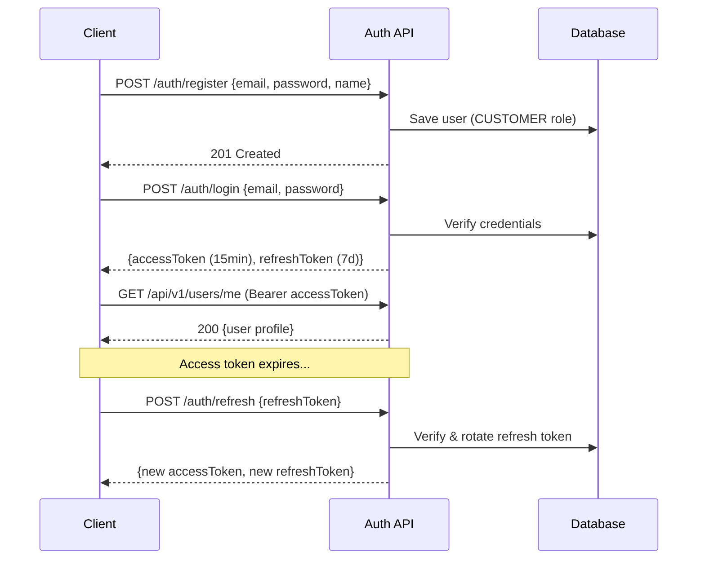
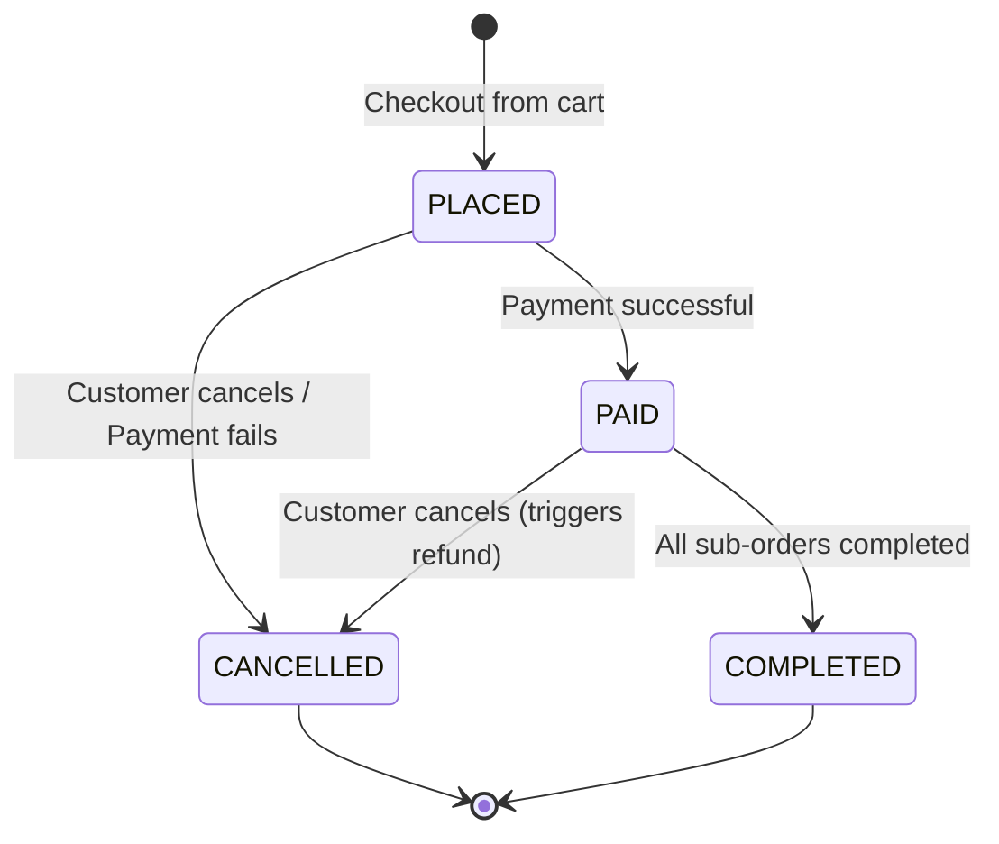
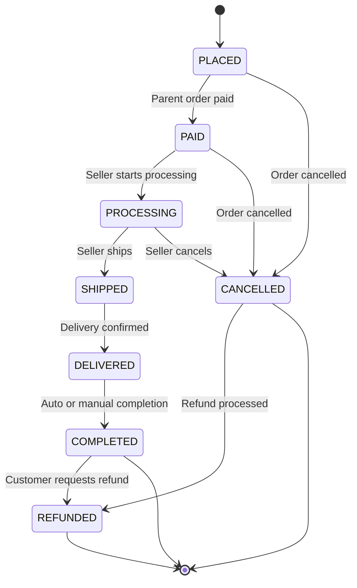
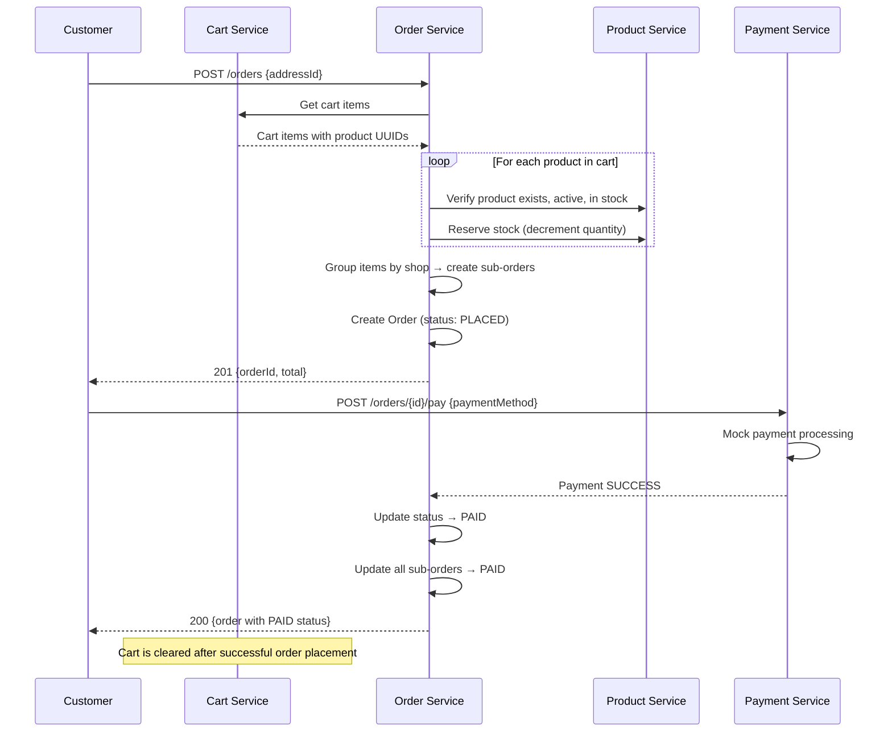

# Architecture — Flows & Security

---

## 8. Authentication & Authorization

### 8.1 JWT Flow

### 8.2 Role-Based Access (RBAC)

| Role | Permissions |
|---|---|
| **CUSTOMER** | Browse products, manage cart, place orders, write reviews, manage wishlist, manage addresses |
| **SELLER** | Everything CUSTOMER can do + create shop, list products, manage inventory, fulfill orders |
| **ADMIN** | Everything + manage categories, view all users, manage platform |

---

## 9. Order Lifecycle (State Machine)

### 9.1 Order-Level States

### 9.2 Sub-Order-Level States (per seller)

### 9.3 Checkout Flow

---

## 10. Domain Events

| Event | Publisher | Subscriber(s) | Purpose |
|---|---|---|---|
| `OrderPlacedEvent` | Order module | Product module | Reserve inventory (decrement stock) |
| `OrderCancelledEvent` | Order module | Product module | Release inventory (increment stock) |
| `OrderRefundedEvent` | Order module | Product module | Release inventory (increment stock) |
| `ProductDeletedEvent` | Product module | Order module, Review module | Handle deleted product references |
| `UserBecameSellerEvent` | User module | — (future use) | Track seller registrations |
