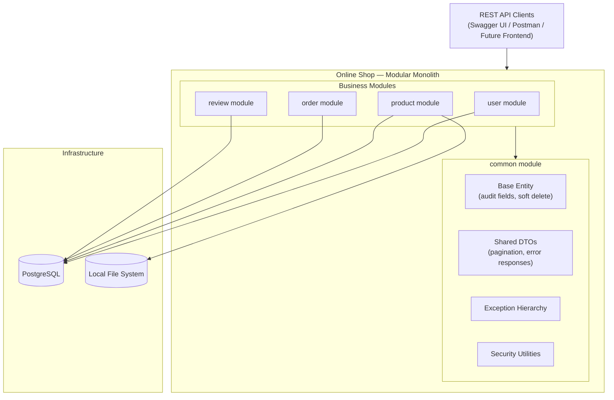
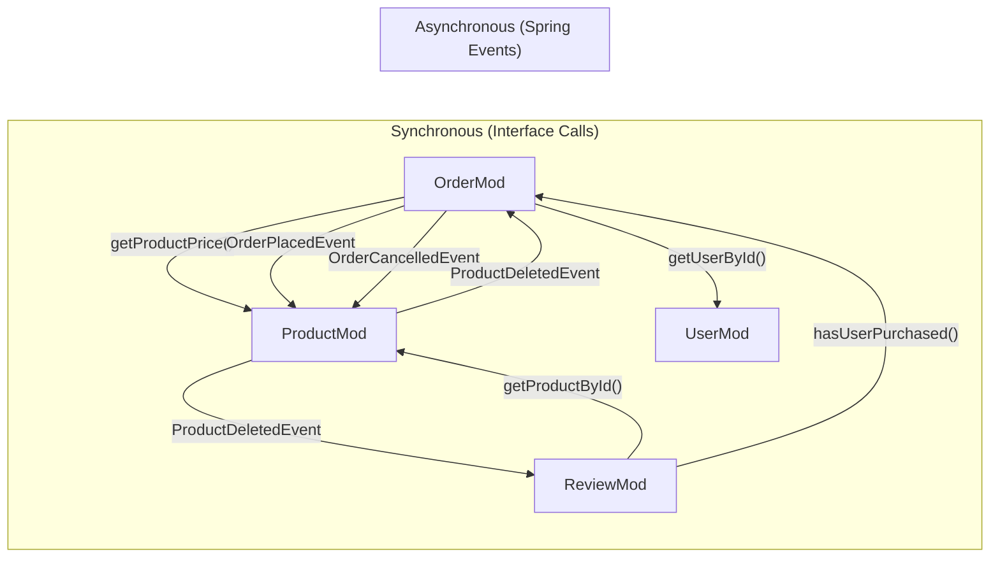

# Architecture — High-Level & Module Structure

---

## 3.1 High-Level Architecture



## 3.2 Module Overview

| Module | Responsibility | DB Schema | Key Entities |
|---|---|---|---|
| **common** | Cross-cutting concerns (base entity, shared DTOs, exceptions, security config) | — (no own schema) | `BaseEntity`, `ApiError` |
| **user** | Registration, authentication, profiles, roles, addresses | `user_schema` | `User`, `Role`, `Address` |
| **product** | Shops, products, categories, inventory, images, search | `product_schema` | `Shop`, `Product`, `Category`, `ProductImage` |
| **order** | Cart, checkout, orders, sub-orders, payment, order lifecycle | `order_schema` | `Cart`, `CartItem`, `Order`, `SubOrder`, `SubOrderItem`, `Payment` |
| **review** | Product reviews & ratings, wishlist | `review_schema` | `Review`, `WishlistItem` |

## 3.3 Module Communication



**Rules:**
- **Queries (reads):** Direct method calls through exposed interfaces. Module A injects Module B's public interface.
- **Commands (state changes):** Domain events published via Spring's `ApplicationEventPublisher`. Subscribers react asynchronously.
- **No cross-module JPA joins:** Modules never reference each other's entities directly. Use IDs and interface calls.

---

## 4. Maven Project Structure

```
online-shop/                          # Parent POM
├── pom.xml                           # Parent POM (dependency management, plugins)
├── docker-compose.yaml               # PostgreSQL
├── common/                           # Shared module
│   ├── pom.xml
│   └── src/
├── user/                             # User & Auth module
│   ├── pom.xml
│   └── src/
├── product/                          # Product & Catalog module
│   ├── pom.xml
│   └── src/
├── order/                            # Cart & Order module
│   ├── pom.xml
│   └── src/
├── review/                           # Review & Wishlist module
│   ├── pom.xml
│   └── src/
└── app/                              # Application entry point (Spring Boot main class)
    ├── pom.xml                       # Depends on all modules
    └── src/
        └── main/
            ├── java/.../OnlineShopApplication.java
            └── resources/
                └── application.yaml
```

> [!IMPORTANT]
> The `app` module is the runnable Spring Boot application. It has dependencies on all business modules and contains the `main()` class, `application.yaml`, and global configuration.
